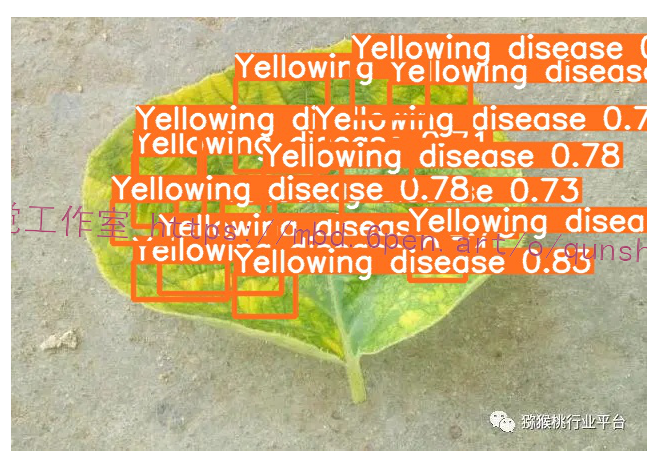

# 1.背景
现如今由于农作物病虫害的多样性和复杂性，在特定的条件下其很容易在大范围内发生，导致农产品产量急剧下降。因此，预防和监测农作物病虫害已成为农业生产活动中的重要环节。当前，耕地面积逐渐减少，世界人口总数逐渐增加，导致人均耕地数量减少。 “吃饭问题” 成为了对现代社会农业政策、管理模式、技术手段的重大考验，因此如何保障农作物产能满足新增人口需求成为一个日益严峻的问题。随着大规模生产的集约化，农作物病虫害爆发影响会更大，生产能力的输出起着决定性的作用。作物病虫害是中国的主要农业灾害之一，其具有种类多、影响大、灾害频发的特点，甚至造成农作物大面积减产; 其灾害范围和严重程度常常给中国国民经济特别是农业生产造成巨大损失。在农作物生产活动中可能受到多种病虫害交杂影响，其中某些并不能被肉眼所识别，其可能也是破坏农作物植株正常生理状态的重点诱因，致使农作物基因突变、细胞变异或者组织损伤，从而带来减产、甚至绝产后果。

# 2.识别效果





# 3.视频演示
[[项目分享]Python基于改进YOLOv5的猕猴桃叶病害检测系统（完整源码＆数据集＆视频教程）_哔哩哔哩_bilibili](https://www.bilibili.com/video/BV1Ld4y1G7eo/?vd_source=bc9aec86d164b67a7004b996143742dc)


# 4.训练结果
### Precision＆Recall＆Map＆So on


### 混淆矩阵


### 其他参数结果图


# 5.[数据集](https://afdian.net/item?plan_id=7132dd20625811edb2c052540025c377)


# 6.[代码实现](https://mbd.pub/o/bread/Yp6ampdt)
```
"""定制resnet后面的层"""
def custom(input_size,num_classes,pretrain):
    # 引入初始化resnet50模型
    base_model = ResNet50(weights=pretrain,
                          include_top=False,
                          pooling=None,
                          input_shape=(input_size,input_size, 3),
                          classes=num_classes)
    #由于有预权重，前部分冻结，后面进行迁移学习
    for layer in base_model.layers:
        layer.trainable = False
    #添加后面的层
    x = base_model.output
    x = layers.GlobalAveragePooling2D(name='avg_pool')(x)
    x = layers.Dropout(0.5,name='dropout1')(x)
    #regularizers正则化层，正则化器允许在优化过程中对层的参数或层的激活情况进行惩罚
    #对损失函数进行最小化的同时，也需要让对参数添加限制，这个限制也就是正则化惩罚项，使用l2范数
    x = layers.Dense(512,activation='relu',kernel_regularizer= regularizers.l2(0.0001),name='fc2')(x)
    x = layers.BatchNormalization(name='bn_fc_01')(x)
    x = layers.Dropout(0.5,name='dropout2')(x)
    #40个分类
    x = layers.Dense(num_classes,activation='softmax')(x)
    model = Model(inputs=base_model.input,outputs=x)
    #模型编译
    model.compile(optimizer="adam",loss = 'categorical_crossentropy',metrics=['accuracy'])
    return model
```
```
class Net():
    def __init__(self,img_size,gar_num,data_dir,batch_size,pretrain):
        self.img_size=img_size
        self.gar_num=gar_num
        self.data_dir=data_dir
        self.batch_size=batch_size
        self.pretrain=pretrain

    def build_train(self):
        """迁移学习"""
        model = resnet.custom(self.img_size, self.gar_num, self.pretrain)
        model.summary()

        train_sequence, validation_sequence = genit.gendata(self.data_dir, self.batch_size, self.gar_num, self.img_size)

        epochs=4
        model.fit_generator(train_sequence,steps_per_epoch=len(train_sequence),epochs=epochs,verbose=1,validation_data=validation_sequence,
                                     max_queue_size=10,shuffle=True)
        #微调,在实际工程中，激活函数也被算进层里，所以总共181层，微调是为了重新训练部分卷积层，同时训练最后的全连接层
        layers=149
        learning_rate=1e-4
        for layer in model.layers[:layers]:
            layer.trainable = False
        for layer in model.layers[layers:]:
            layer.trainable = True
        Adam =adam(lr=learning_rate, decay=0.0005)
        model.compile(optimizer=Adam, loss='categorical_crossentropy', metrics=['accuracy'])

        model.fit_generator(train_sequence,steps_per_epoch=len(train_sequence),epochs=epochs * 2,verbose=1,
            callbacks=[
                callbacks.ModelCheckpoint('./models/garclass.h5',monitor='val_loss', save_best_only=True, mode='min'),
                callbacks.ReduceLROnPlateau(monitor='val_loss', factor=0.1,patience=10, mode='min'),
                callbacks.EarlyStopping(monitor='val_loss', patience=10),],
            validation_data=validation_sequence,max_queue_size=10,shuffle=True)

        print('finish train,look for garclass.h5')
```

[环境部署视频教程&完整源码&标注好的数据集](https://s.xiaocichang.com/s/30ad74)
参考博客[《\[智慧农业\]Python基于改进YOLOv5的猕猴桃叶病害检测系统（完整源码＆数据集＆视频教程）》](https://mbd.pub/o/qunma/work)

# 7.参考文献
**1.[期刊论文]**基于神经网络的智慧农业病虫识别系统设计与应用

**期刊：**《农业与技术》 | 2021 年第 002 期

**摘要：**病虫害一直以来都是农业种植户担心的问题,虽然无法让病虫害问题不再产生,但农业种植户可以通过科技设备、病虫害目前情况以及发展情况提前预测,及时采取防控措施,减少病虫害对农业生产的危害.该平台的病虫害预警监测系统,设备层采用农业墒情、苗情、虫情、灾情实时监测的专用仪器,采集作物图像信息,运用神经网络算法进行模拟分析,最终给平台使用人员提出病虫害结论,实时监测作物的病虫害发生情况;系统可以帮助农业种植户在第一时间获得详细的农业作物生长情况、作物病害、虫害的数据,还可以进行远程专家诊断问答机制.

**关键词：**农业；智慧；病虫识别

**链接：**[https://www.zhangqiaokeyan.com/academic-journal-cn_agriculture-technology_thesis/0201288479126.html](https://link.zhihu.com/?target=https%3A//www.zhangqiaokeyan.com/academic-journal-cn_agriculture-technology_thesis/0201288479126.html%3Ffrom%3Dlzhh-3-2-1-4p-9278)

---------------------------------------------------------------------------------------------------

**2.[期刊论文]**MobileNet算法的嵌入式农业病虫害识别系统

**期刊：**《单片机与嵌入式系统应用》 | 2020 年第 005 期

**关键词：**图像识别；树莓派；MobileNet；Cortex-M3

**链接：**[https://www.zhangqiaokeyan.com/academic-journal-cn_microcontrollers-embedded-systems_thesis/0201278624524.html](https://link.zhihu.com/?target=https%3A//www.zhangqiaokeyan.com/academic-journal-cn_microcontrollers-embedded-systems_thesis/0201278624524.html%3Ffrom%3Dlzhh-3-2-1-4p-9278)

---------------------------------------------------------------------------------------------------

**3.[期刊论文]**基于深度学习的病虫害智能化识别系统

**期刊：**《中国植保导刊》 | 2019 年第 004 期

**摘要：**我国农作物种植覆盖面广、分散度高,病虫害发生种类多、区域性发生规律复杂,传统的人工鉴定技术从效率、能力与精度方面均难以满足新形势下重大病虫测报要求.针对这一实践需求,以测报灯下害虫图像数据库(约18万张)、田间病虫害图像数据库(约32万张)为基础,构建了基于深度学习方法的病虫害种类特征自动学习、特征融合、识别和位置回归计算框架,并研发了移动式病虫害智能化感知设备和自动识别系统.通过近2年的精确度和实操运行效率检验,该系统在自然状态下对16种灯下常见害虫的识别率为66％～90％,对38种田间常见病虫害(症状)的识别率为50％～90％.随基础数据库的不断丰富、神经网络深层特征提取的不断完善,该系统有望进一步提高识别准确率,从而真正实现田间病虫害识别自动化、智能化和高效率.

**关键词：**深度学习；病虫害；检测；识别

**链接：**[https://www.zhangqiaokeyan.com/academic-journal-cn_china-plant-protection_thesis/0201270636760.html](https://link.zhihu.com/?target=https%3A//www.zhangqiaokeyan.com/academic-journal-cn_china-plant-protection_thesis/0201270636760.html%3Ffrom%3Dlzhh-3-2-1-4p-9278)

---------------------------------------------------------------------------------------------------

**4.[期刊论文]**基于ARM的作物病虫害自动识别系统设计

**期刊：**《南方农机》 | 2019 年第 005 期

**摘要：**农业作为我国基础产业,关系到国计民生,是国民经济的命脉.作物病虫害是面向农业生产的虫害及病害的总称,能够对作物种植生长产生不良影响.ARM是RISC精简指令集微处理器,具有体积小、功耗低、低成本、高性能的特点.本文基于ARM对作物病虫害的自动识别系统构建方法进行研究,对系统设计理念进行阐述,仅供参考.

**关键词：**农业；作物病虫害；自动识别

**链接：**[https://www.zhangqiaokeyan.com/academic-journal-cn_china-southern-agricultural-machinery_thesis/0201270632397.html](https://link.zhihu.com/?target=https%3A//www.zhangqiaokeyan.com/academic-journal-cn_china-southern-agricultural-machinery_thesis/0201270632397.html%3Ffrom%3Dlzhh-3-2-1-4p-9278)

---------------------------------------------------------------------------------------------------

**5.[期刊论文]**基于微信公众号的农业病虫害识别系统数据库设计

**期刊：**《河北农机》 | 2018 年第 011 期

**摘要：**本文尝试将传统数据库与微信公众平台的服务号结合,以农业病虫害识别系统为例,实现基于微信公众号的图像数据库建设,为农业种植户搭建了一个便捷的病虫害查询、识别、预测平台.

**关键词：**微信平台；病虫害；数据库

**链接：**[https://www.zhangqiaokeyan.com/academic-journal-cn_hebei-agricultural-machinery_thesis/0201270617324.html](https://link.zhihu.com/?target=https%3A//www.zhangqiaokeyan.com/academic-journal-cn_hebei-agricultural-machinery_thesis/0201270617324.html%3Ffrom%3Dlzhh-3-2-1-4p-9278)

---------------------------------------------------------------------------------------------------

**6.[专** **利]**一种基于人工智能病虫害智能识别系统

**发布日：**2021-07-16

**摘要：**本实用新型公开了病虫害识别技术领域中一种基于人工智能病虫害智能识别系统，包括移动车、拍摄机和移动车等，移动车位于铺设在种植作物之间的轨道上，通过移动车在轨道上行走带动拍摄机对种植作物进行拍摄，此种拍摄方式对种植作物具有定时监测作用，可及时的发现病虫害的存在，并对管理者进行提示，防护措施及时会更进一步减少种植者的损失，移动车在轨道上反复位移，拍摄机将对应位置处拍摄图片通过无线通信模块传递至远程服务器终端，远程服务器终端接收图像数据后利用训练好模型对图像进行识别，并将结果返回给种植者所在的移动终端，根据识别结果指导种植者精准施药。本实用新型使用方便，可以更加及时的对病虫害进行诊断和防控。

**链接：**[https://www.zhangqiaokeyan.com/patent-detail/06120213658157.html](https://link.zhihu.com/?target=https%3A//www.zhangqiaokeyan.com/patent-detail/06120213658157.html%3Ffrom%3Dlzhh-3-2-1-4p-9278)

---------------------------------------------------------------------------------------------------

**7.[专** **利]**一种橡胶树病虫害识别系统的手持设备

**发布日：**2021-04-09

**摘要：**本发明涉及一种橡胶树病虫害识别系统的手持设备，属于橡胶树林智能管理领域，包括：枪式架体，所述枪式架体包括手柄架、伸缩架和三叉支架；图像采集器，设置于所述枪式架体上并能够朝向枪式架体的前侧拍摄图像；传感器系统，设置于所述枪式架体上并能够检测图像拍摄位置高度、检测植株茎干表皮厚度或/和植株直径；控制器，设置于所述枪式架体上，控制器分别与图像采集器和传感器系统电连接并能够对外发送传感器的数据和拍摄的图像；能够根据实际情况在橡胶林中对判断橡胶树病虫害的数据和图像进行便捷采集，并且能够与配置的后台处理器及数据库进行通信，从而现场进行病虫害识别，做到早发现早预防。

**链接：**[https://www.zhangqiaokeyan.com/patent-detail/06120112586248.html](https://link.zhihu.com/?target=https%3A//www.zhangqiaokeyan.com/patent-detail/06120112586248.html%3Ffrom%3Dlzhh-3-2-1-4p-9278)

---------------------------------------------------------------------------------------------------

**8.[专** **利]**一种橡胶树病虫害智能识别系统

**发布日：**2021-04-09

**摘要：**本发明涉及一种橡胶树病虫害智能识别系统，属于橡胶树林智能管理领域，包括:图像采集器，能够搭载在手持设备或无人机上；病虫害数据库，存储包括症状特征、症状诱因、症状影响及症状预防和治疗措施；后台处理器，能够接收图像采集端发送的图像，并提取图像中的症状数据，将症状数据和病虫害数据库中的症状特征进行对比匹配，症状数据包括颜色、形状、分布位置和面积；云端服务器，能够同步病虫害数据库中的病虫害信息；移动端，能够通过云端服务器与后台处理器通信，并能够验证或修改后台处理器的匹配结果；能够现场对橡胶树进行图像采集和病虫害症状匹配，能够使得任何人都能够橡胶林病虫害的现场确认，做到橡胶树病虫害的早发现早防治。

**链接：**[https://www.zhangqiaokeyan.com/patent-detail/06120112586448.html](https://link.zhihu.com/?target=https%3A//www.zhangqiaokeyan.com/patent-detail/06120112586448.html%3Ffrom%3Dlzhh-3-2-1-4p-9278)

---------------------------------------------------------------------------------------------------

**9.[专** **利]**基于卷积神经网络的农业病虫害图像自动识别分类系统

**发布日：**2021-05-28

**摘要：**本发明公开了基于卷积神经网络的农业病虫害图像自动识别分类系统，属于病虫害识别领域，基于卷积神经网络的农业病虫害图像自动识别分类系统，视频录入装置主体上搭载摄像头会对自身所在区域的环境进行拍照得到对应的图片信息，而视频录入装置主体内搭载的空投球再对图片信息进行识别，监控环境中昆虫及其他生物的群落和活动信息，并通过物联网模块上传至控制终端内进行备份，技术人员可以通过控制终端所受到的视频信息对上述图片信息进行人工识别，及时发现病虫害的迹象，可以实现通过基于卷积神经网络技术工作的自动识别分类系统对种植区内的昆虫种群和数量进行监控，可以及早的发现病虫害，并进行灭杀工作。

**链接：**[https://www.zhangqiaokeyan.com/patent-detail/06120112810006.html](https://link.zhihu.com/?target=https%3A//www.zhangqiaokeyan.com/patent-detail/06120112810006.html%3Ffrom%3Dlzhh-3-2-1-4p-9278)

---------------------------------------------------------------------------------------------------

**10.[专** **利]**一种无人机飞防及病虫害智能识别系统

**发布日：**2021-03-09

**摘要：**本发明公开了一种无人机飞防及病虫害智能识别系统，包括移动控制终端、无线通讯模块、无人机主控装置、云数据处理中心。移动控制终端用于设置飞防参数，查看无人机采集的数据；无线通讯模块用于系统中子模块的数据交互传输；无人机主控装置用于控制无人机的飞行、施药和影像采集；云数据处理中心用于分析无人机采集的影像数据，通过卷积神经网络识别无人机采集的病虫害影像，分析得出病虫害识别结果和防效数据，通过无线通讯模块传输到移动控制终端进行查看。本发明将无人机飞防与航拍进行融合，在飞防的同时进行田间影像航拍，利用卷积神经网络技术进行病虫害智能识别判断，在飞防的同时进行虫害拍摄并智能识别，充分利用了无人机资源。


---
#### 如果您需要更详细的【源码和环境部署教程】，除了通过【系统整合】小节的链接获取之外，还可以通过邮箱以下途径获取:
#### 1.请先在GitHub上为该项目点赞（Star），编辑一封邮件，附上点赞的截图、项目的中文描述概述（About）以及您的用途需求，发送到我们的邮箱
#### sharecode@yeah.net
#### 2.我们收到邮件后会定期根据邮件的接收顺序将【完整源码和环境部署教程】发送到您的邮箱。
#### 【免责声明】本文来源于用户投稿，如果侵犯任何第三方的合法权益，可通过邮箱联系删除。